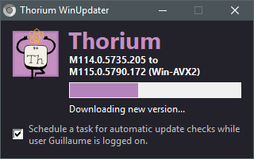

# LibreWolf WinUpdater
by ltGuillaume: [Codeberg](https://codeberg.org/ltGuillaume) | [GitHub](https://github.com/ltGuillaume) | [Buy me a beer](https://buymeacoff.ee/ltGuillaume) 🍺

An attempt to make updating LibreWolf for Windows much easier.

## Getting started
- If you want to run the portable version of LibreWolf, download and extract [`librewolf-xx.x.en-US.win64.portable.zip`](https://gitlab.com/librewolf-community/browser/bsys6/-/releases). It already contains a compiled version of the project hosted here. Updates will automatically be downloaded and extracted before running LibreWolf via `LibreWolf-Portable.exe`.  
  WinUpdater will automatically update LibreWolf whenever you run `LibreWolf-Portable.exe` (checking for a new version once a day).  
- If you have installed LibreWolf, the [official installer](https://librewolf.net/installation/windows/) includes an option to install WinUpdater along with LibreWolf.  
  Alternatively, you can download and extract the latest [`LibreWolf-WinUpdater_x.x.x.zip`](https://codeberg.org/ltGuillaume/LibreWolf-WinUpdater/releases) to a folder you like, e.g. `%AppData%\LibreWolf`. Run `LibreWolf-WinUpdater.exe` to check for an update. If one is available, it will be downloaded immediately.  

## Scheduled updates
- Run LibreWolf WinUpdater and select the option to automatically check for updates. This will prompt for administrator permissions and a blue (PowerShell) window will notify you of the result. The scheduled task will run while the current user account is logged on (at start-up and every 4 hours). If your account has administrator permissions, the update will be fully automatic. If not, the update will be downloaded and you will be asked to start the update by WinUpdater.  
  If LibreWolf is already running, the updater will notify you of the new version and start the update as soon as you close the browser. The last result can be found in `LibreWolf-WinUpdater.ini`.  

## Remarks
- If you're having issues with the updater on __Windows 7__, please have a look at [these instructions](https://codeberg.org/ltGuillaume/LibreWolf-WinUpdater/issues/15).
- The updater needs to be able to write to `LibreWolf-WinUpdater.ini` in its own folder, so make sure it has permission to do so.
- The ini-file contains a `[Log]` section that shows the last update check's result and the last update action.

## Credits
* [LibreWolf](https://librewolf.net) by [ohfp](https://gitlab.com/ohfp), [stanzabird](https://stanzabird.nl), [fxbrit](https://gitlab.com/fxbrit), [maltejur](https://gitlab.com/maltejur), [bgstack15](https://bgstack15.wordpress.com) et al.
* Original icon by the [LibreWolf Community](https://gitlab.com/librewolf-community/branding/-/tree/master/icon)
